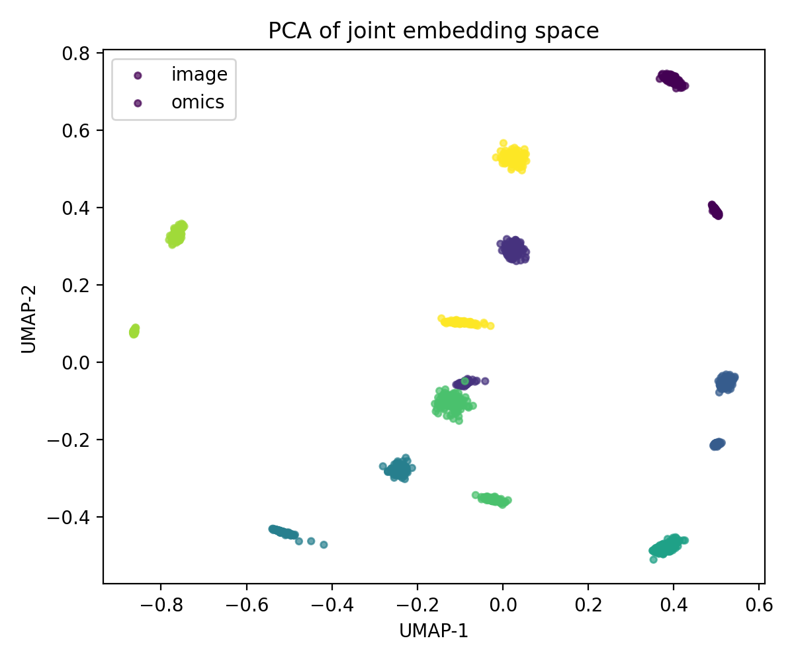
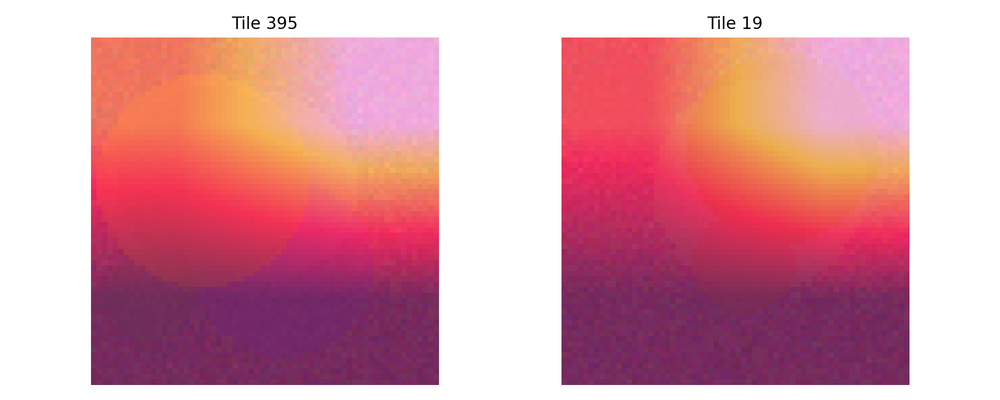

# RejuvBridge-lite Report

**Retrieval**: R@1=0.010 (95% CI 0.004-0.018), R@5=0.050

## Model card (lite)
- Intended use: synthetic demo of image–omics alignment.
- Not in scope: clinical claims, real WSI pipelines, spatial transcriptomics.
- Runtime: CPU < 10 min; deterministic seeds.
